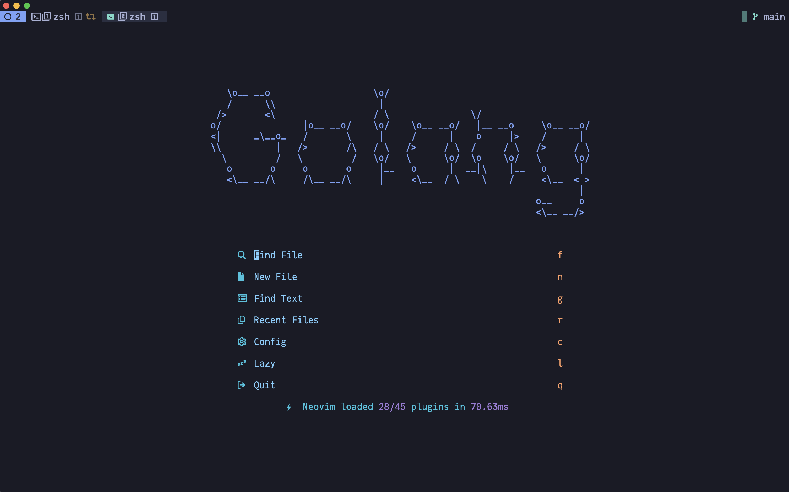
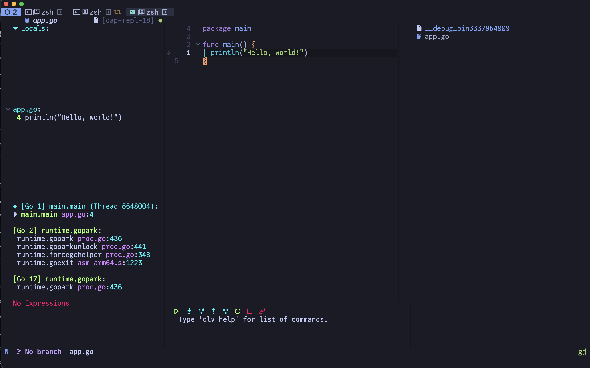
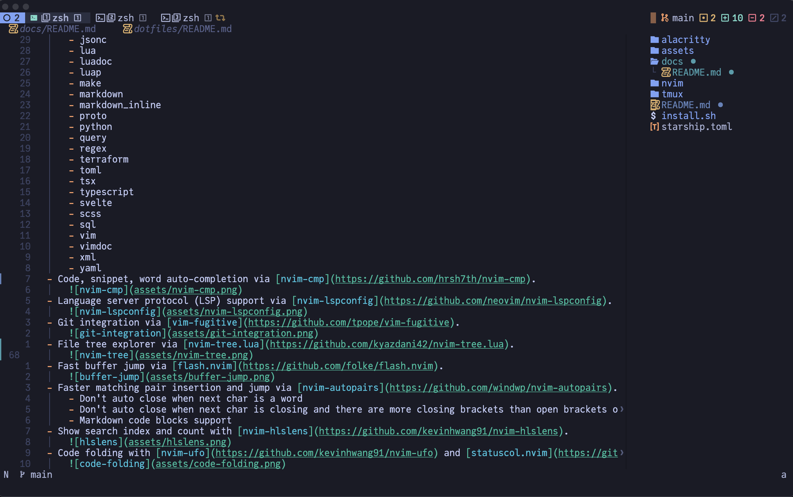
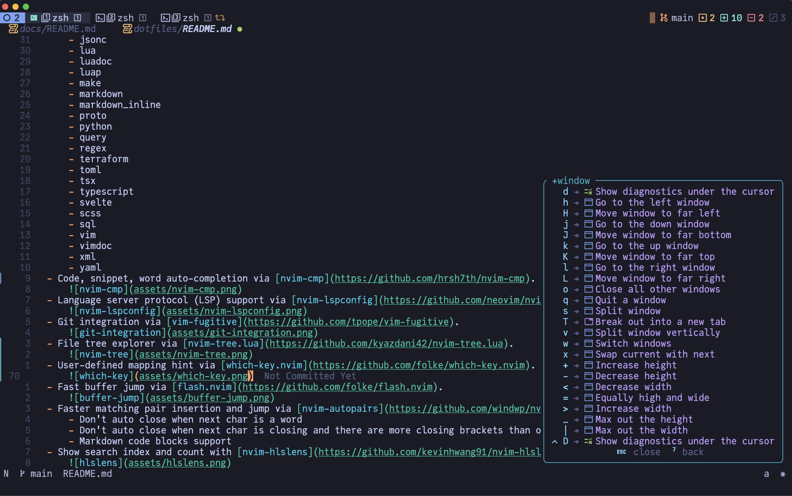
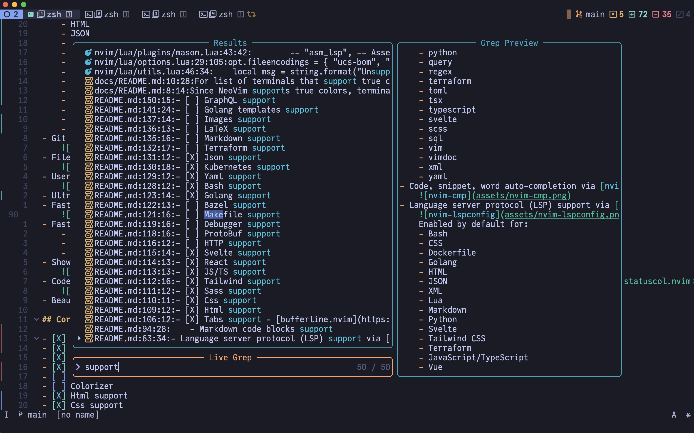
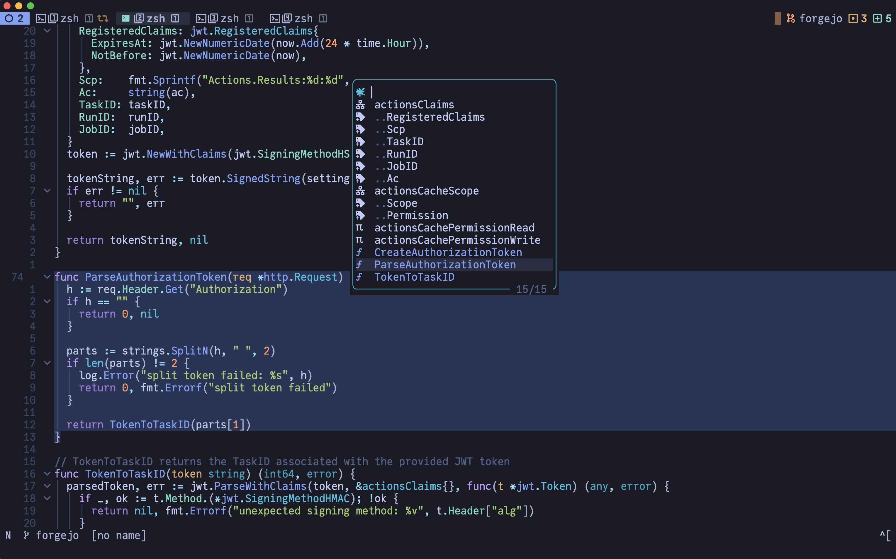
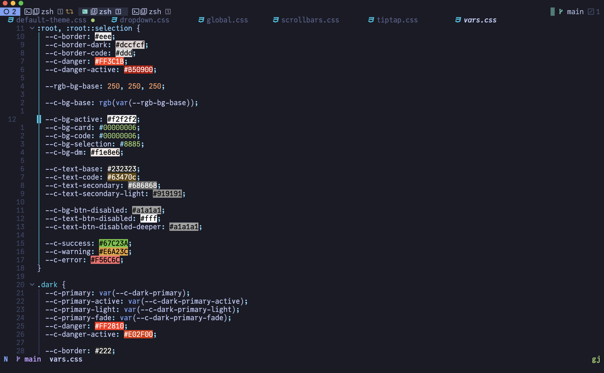
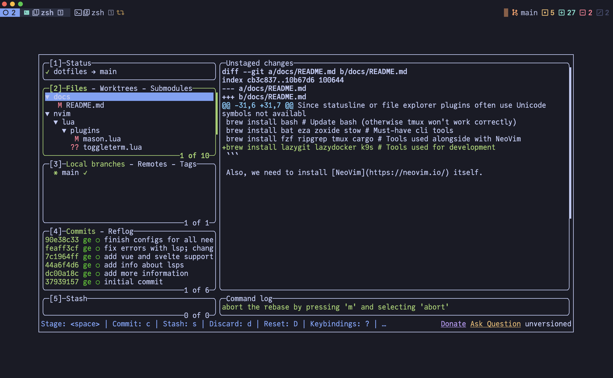
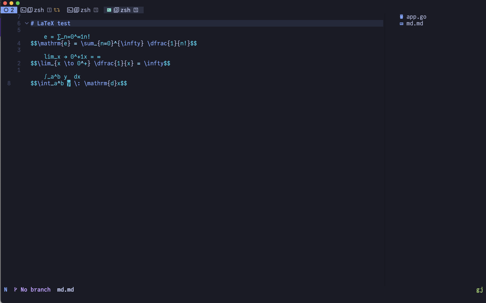

# Modern NeoVim configuration with full battery for Golang development

## Introduction

This repo hosts my NeoVim configuration for Golang development, primarily for MacOS users.
`init.lua` is the configuration entry point for terminal NeoVim.

My configuration are heavily documented to make as clear as possible.
While you can clone the whole repository and use it, it is not recommended though.
Good configurations are personal.
Everyone should have his or her unique configuration.

## Install and setup

See [docs](docs/README.md) on how to install dependencies and NeoVim itself.

## Features

- Plugin management via [Lazy.nvim](https://github.com/folke/lazy.nvim).
  
- Beuatiful dashboard via [snacks.nvim](https://github.com/folke/snacks.nvim).
  
- Code, snippet, word auto-completion via [nvim-cmp](https://github.com/hrsh7th/nvim-cmp).
  
- Language server protocol (LSP) support via [nvim-lspconfig](https://github.com/neovim/nvim-lspconfig).
  More details in [docs/lsp.md](docs/lsp.md).
  
- Debug integration via [nvim-dap-ui](https://github.com/rcarriga/nvim-dap-ui).
  
- Git integration via [vim-fugitive](https://github.com/tpope/vim-fugitive).
  
- File tree explorer via [nvim-tree.lua](https://github.com/kyazdani42/nvim-tree.lua).
  
- User-defined mapping hint via [which-key.nvim](https://github.com/folke/which-key.nvim).
  
- Ultra-fast project-wide fuzzy search via [telescope.nvim](https://github.com/nvim-telescope/telescope.nvim).
  
- Symbol navigation via [namu.nvim](https://github.com/bassamsdata/namu.nvim).
  
- Fast buffer jump via [flash.nvim](https://github.com/folke/flash.nvim).
  
- Show search index and count with [nvim-hlslens](https://github.com/kevinhwang91/nvim-hlslens).
  
- Code folding with [nvim-ufo](https://github.com/kevinhwang91/nvim-ufo) and [statuscol.nvim](https://github.com/kdheepak/statuscol.nvim).
  
- Colorizer via [nvim-colorizer.lua](https://github.com/norcalli/nvim-colorizer.lua).
  
- Float terminal integration via [toggleterm.nvim](https://github.com/akinsho/toggleterm.nvim).
  
- Markdown and LaTeX support via [render-markdown.nvim](https://github.com/MeanderingProgrammer/render-markdown.nvim).
  

And other features:

- Code highlight via [nvim-treesitter](https://github.com/nvim-treesitter/nvim-treesitter).
  Enabled by default:
  - asm
  - bash
  - css
  - diff
  - dockerfile
  - graphql
  - go
  - gomod
  - gosum
  - gotmpl
  - gowork
  - html
  - http
  - javascript
  - jsdoc
  - json
  - jsonc
  - lua
  - luadoc
  - luap
  - make
  - markdown
  - markdown_inline
  - proto
  - python
  - query
  - regex
  - terraform
  - toml
  - tsx
  - typescript
  - svelte
  - scss
  - sql
  - vim
  - vimdoc
  - xml
  - yaml
- Beautiful colorscheme via [tokyonight.nvim](https://github.com/folke/tokyonight.nvim).
- AI helper via [supermaven-nvim](https://github.com/supermamon/supermaven-nvim).
- Faster matching pair insertion and jump via [nvim-autopairs](https://github.com/windwp/nvim-autopairs).
  - Don't auto close when next char is a word
  - Don't auto close when next char is closing and there are more closing brackets than open brackets on the line
  - Markdown code blocks support
- Tabs support via [bufferline.nvim](https://github.com/akinsho/bufferline.nvim).

## External tools

With tmux you can use:

- [lazygit](https://github.com/jesseduffield/lazygit) to interact with git repositories.
- [lazydocker](https://github.com/jesseduffield/lazydocker) to interact with docker containers.
- [k9s](https://github.com/derailed/k9s) to interact with kubernetes clusters.

Because I sure this tools more comfortable and functional than I can reach with NeoVim plugins.
And if you want only check some information and don't want to open extra tab inside tmux, I integrate ToggleTerm inside NeoVim.

Also, I sure we should use external tools for work with REST API and databases instead of NeoVim plugins.

For example, I use:

- [Insomnia](https://insomnia.rest/) for REST API work.
- [DBeaver](https://dbeaver.io/) for database work.

## Debugging

I use [delve](https://github.com/go-delve/delve) debugger for Go.
I don't provide any other debuggers support, because I use Python only for scripting, and JS only for frontend.
In my cases Python and JS don't need debuggers.

## Linting and formatting

I support linters for:

- Go
- Bazel
- Dockefile
- Markdown
- JS/TS, Vue, Svelte
- GraphQL
- HTML, CSS, SCSS
- JSON
- YAML

I support formatters for:

- Go
- Bazel
- JS/TS, Vue, Svelte
- GraphQL
- HTML, CSS, SCSS
- JSON
- YAML

## Extra plans

- [ ] DevContainers
- [ ] Test integration
- [ ] Code coverage
