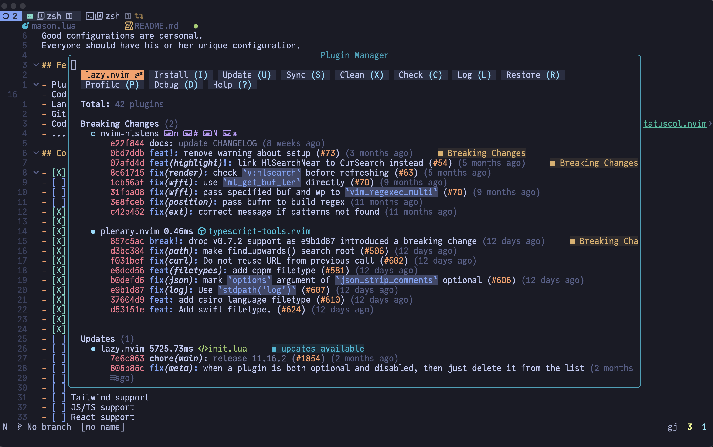
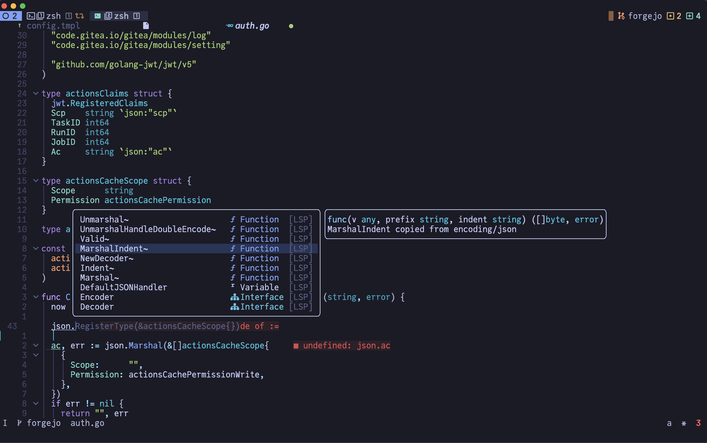
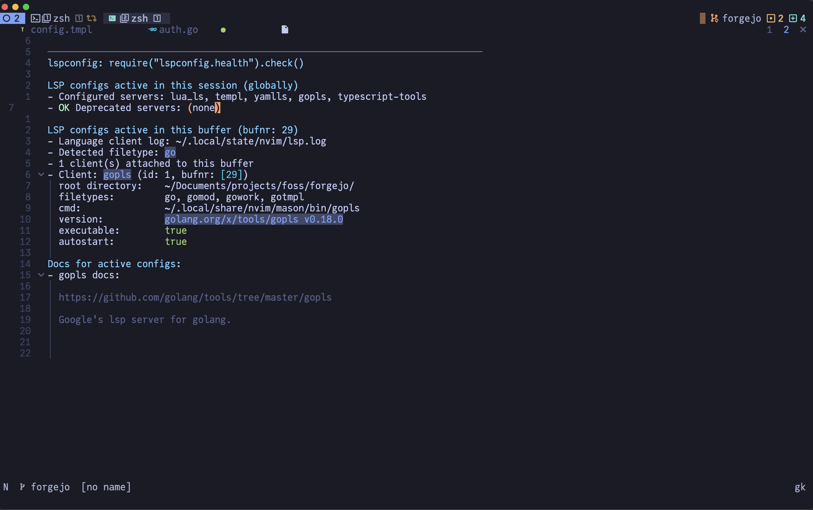
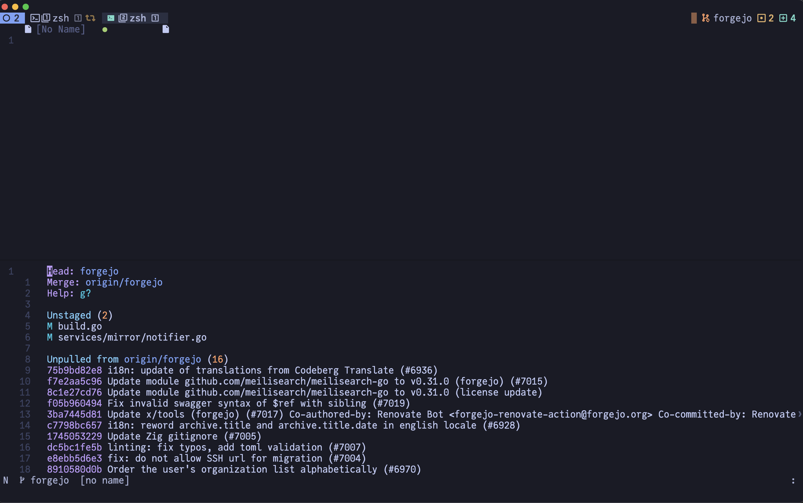
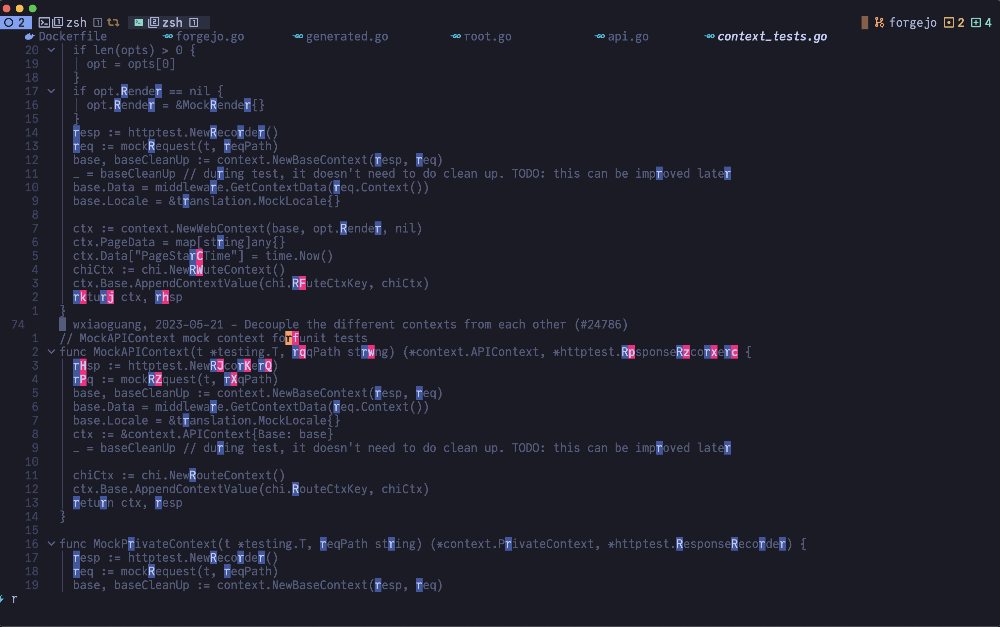
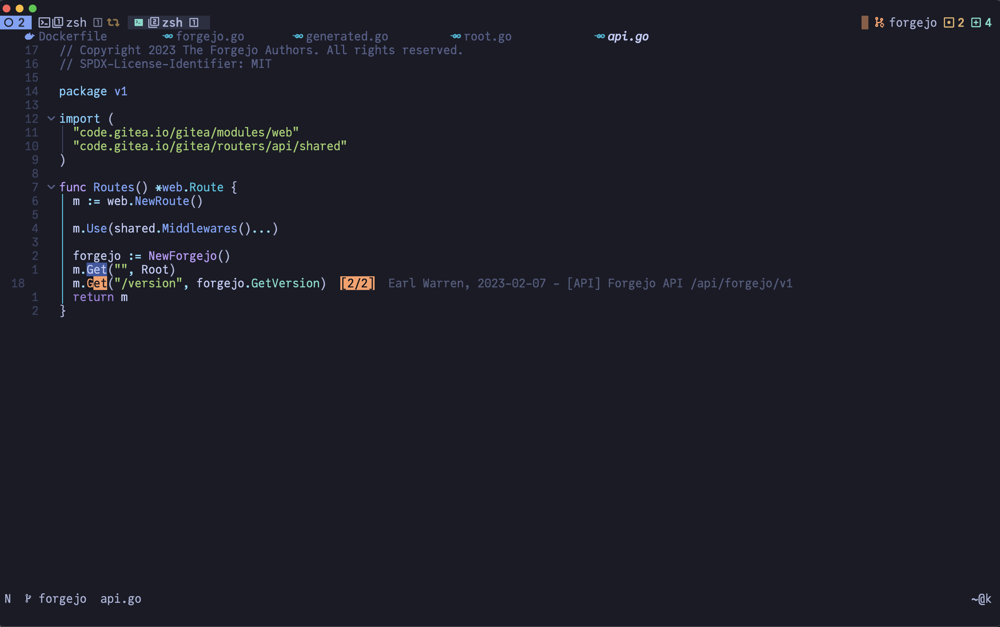

# NeoVim configuration for Golang

## Introduction

This repo hosts my NeoVim configuration for Golang development, primarily for MacOS users.
`init.lua` is the configuration entry point for terminal NeoVim.

My configuration are heavily documented to make as clear as possible.
While you can clone the whole repository and use it, it is not recommended though.
Good configurations are personal.
Everyone should have his or her unique configuration.

## Features

- Plugin management via [Lazy.nvim](https://github.com/folke/lazy.nvim).
    
- Code highlight via [nvim-treesitter](https://github.com/nvim-treesitter/nvim-treesitter).
    Enabled by default: 
    - asm
    - bash
    - css
    - diff
    - dockerfile
    - graphql
    - go
    - gomod
    - gosum
    - gotmpl
    - gowork
    - html
    - http
    - javascript
    - jsdoc
    - json
    - jsonc
    - lua
    - luadoc
    - luap
    - make
    - markdown
    - markdown_inline
    - proto
    - python
    - query
    - regex
    - terraform
    - toml
    - tsx
    - typescript
    - svelte
    - scss
    - sql
    - vim
    - vimdoc
    - xml
    - yaml
- Code, snippet, word auto-completion via -  [nvim-cmp](https://github.com/hrsh7th/nvim-cmp).
    
- Language server protocol (LSP) support via [nvim-lspconfig](https://github.com/neovim/nvim-lspconfig).
    
- Git integration via [vim-fugitive](https://github.com/tpope/vim-fugitive).
    
- Fast buffer jump via [flash.nvim](https://github.com/folke/flash.nvim).
    
- Faster matching pair insertion and jump via [nvim-autopairs](https://github.com/windwp/nvim-autopairs).
    - Don't auto close when next char is a word
    - Don't auto close when next char is closing and there are more closing brackets than open brackets on the line
    - Markdown code blocks support
- Show search index and count with [nvim-hlslens](https://github.com/kevinhwang91/nvim-hlslens).
    
- Code folding with [nvim-ufo](https://github.com/kevinhwang91/nvim-ufo) and [statuscol.nvim](https://github.com/kdheepak/statuscol.nvim).
    
- ........

## Core

- [X] Status line - Custom status line
- [ ] Tests runner && Code coverage
- [ ] Code actions and idea-like refactoring
- [ ] Code generation
- [X] AI helper - [supermaven-nvim](https://github.com/supermamon/supermaven-nvim)
- [X] WhichKey From LazyVim - [which-key.nvim](https://github.com/folke/which-key.nvim)
- [X] File manager - [nvim-tree.lua](https://github.com/nvim-tree/nvim-tree.lua)
- [X] Fuzzy search - [telescope.nvim](https://github.com/nvim-telescope/telescope.nvim)
- [X] Symbol navigation - [namu.nvim](https://github.com/bassamsdata/namu.nvim)
- [X] Tokyonight custom theme - [tokyonight.nvim](https://github.com/folke/tokyonight.nvim)
- [X] Dashboard - [snacks.nvim](https://github.com/folke/snacks.nvim)
- [X] Tabs support - [bufferline.nvim](https://github.com/akinsho/bufferline.nvim)
- [X] LazyDev support - [lazydev.nvim](https://github.com/folke/lazy.nvim)
- [ ] Inlay hints
- [ ] Recursive call detection
- [ ] Colorizer
- [ ] Html support
- [ ] Css support
- [ ] Sass support
- [ ] Tailwind support
- [ ] JS/TS support
- [ ] React support
- [ ] Svelte support
- [ ] HTTP support
- [ ] REST client
- [ ] GraphQL support
- [ ] GraphQL client
- [ ] ProtoBuf support
- [ ] Debugger support
- [ ] Database manager 
- [ ] Makefile support
- [ ] Bazel support
- [X] Golang support
- [ ] Go tools
- [ ] Pprof integration
- [ ] Profiler integration
- [ ] Assembler Plan9
- [ ] Python
- [ ] Docker / Podman integration
- [ ] Kubernetes integration
- [ ] Bash support
- [X] Yaml support
- [ ] Kubernetes support
- [ ] Json support
- [ ] Terraform support
- [X] Tmux integration
- [ ] DevContainers
- [ ] Obsidian integration
- [ ] Markdown support
- [ ] LaTeX support
- [ ] Images support
