# Language server protocol (LSP) support

## Back-End

### Golang

Go support:


Go templates support:

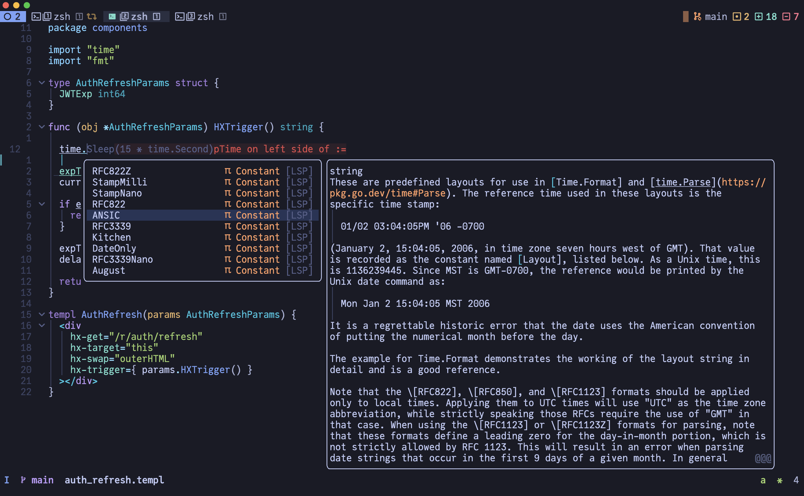

### Python

Python support:

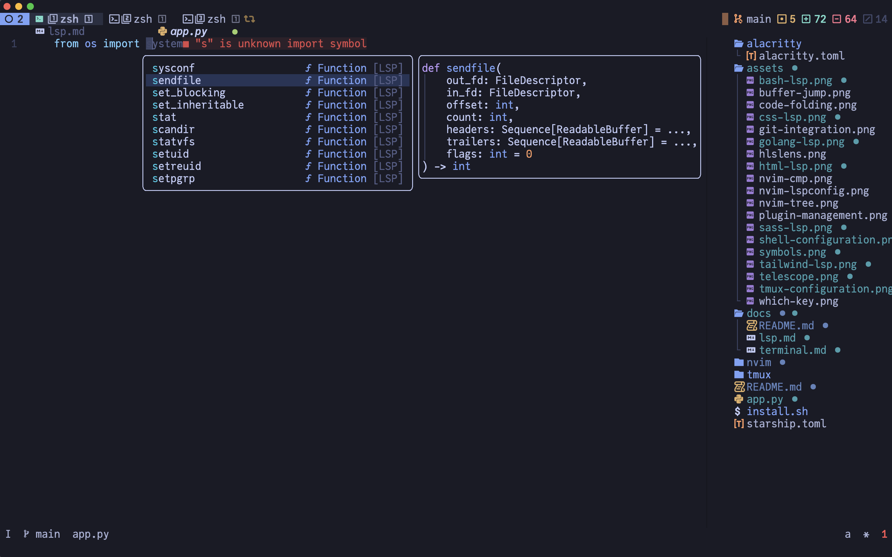

### Bash

Bash support:

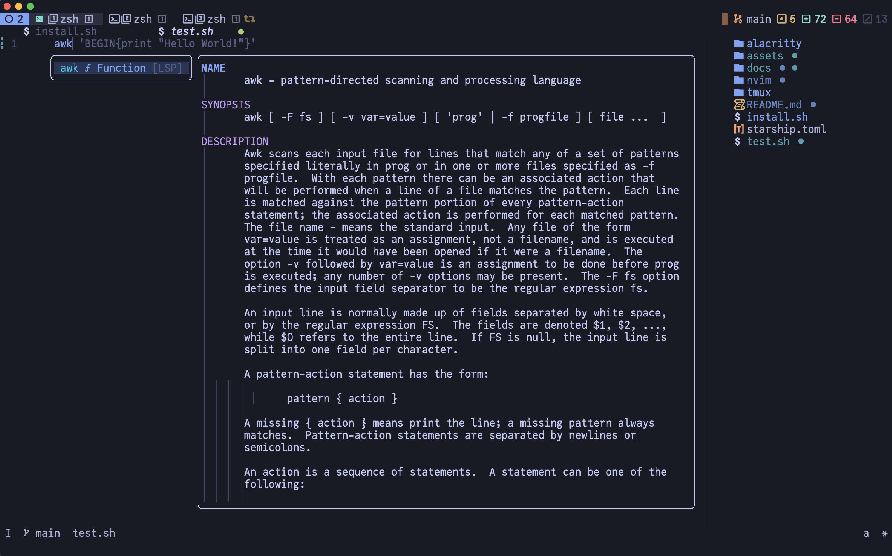

## Front-End

### Html

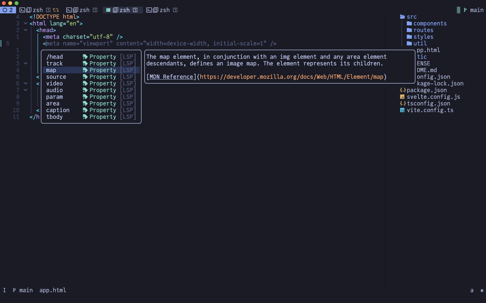

### Css, Sass, Tyailwind

Css support:

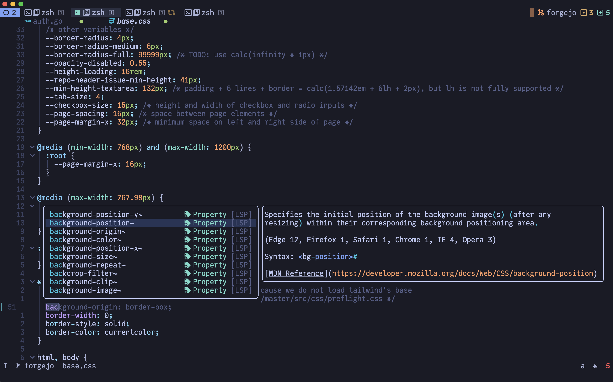

Sass support:

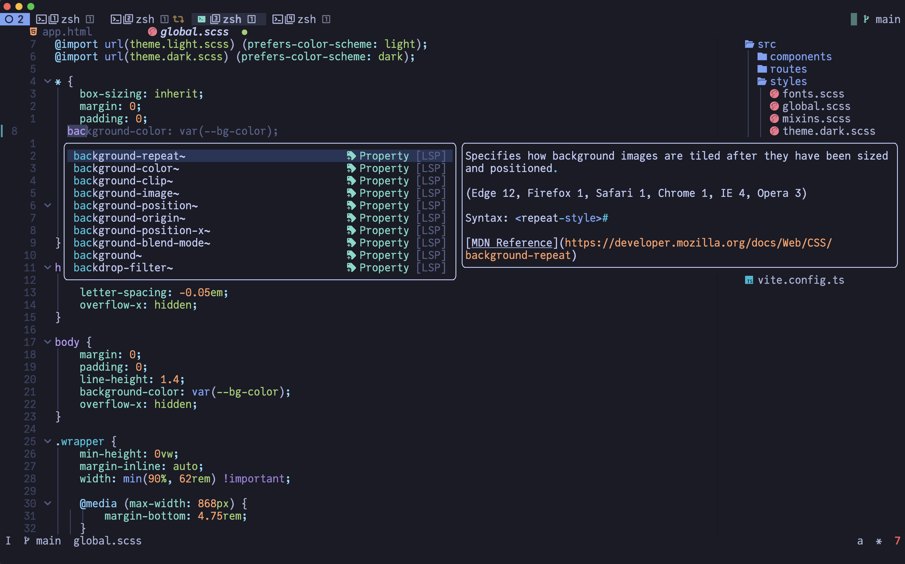

Tailwind support:

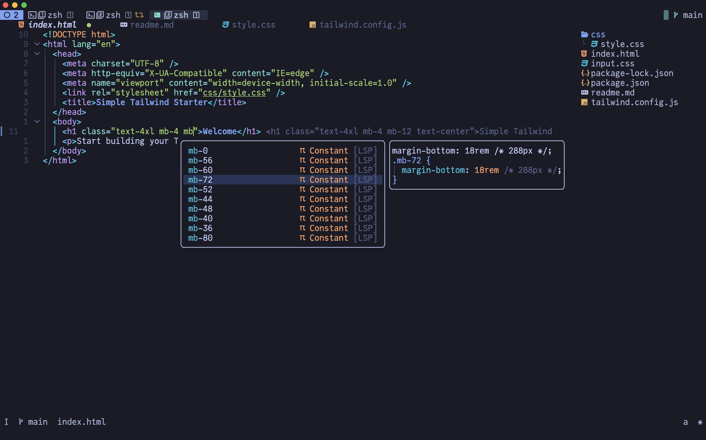

### JavaScript/TypeScript

JavaScript/Typescript support:


### Svelte

Svelte support:

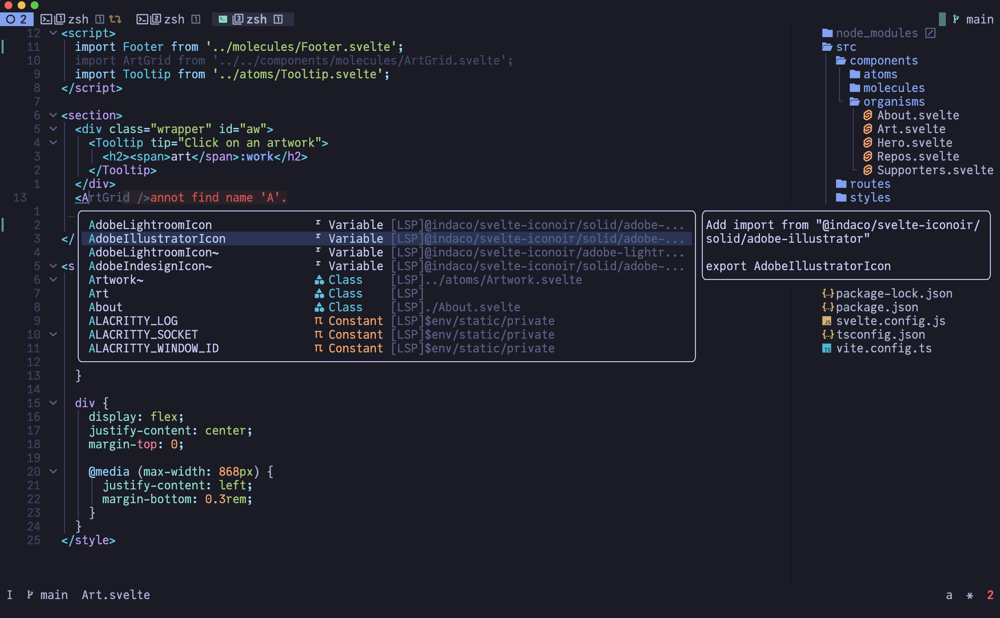

You should install this plugin for typescript:

```bash
npm i -g typescript-svelte-plugin
```

### Vue

Vue support:


You should install this plugin for typescript:

```bash
npm i -g @vue/typescript-plugin
```

## Configs

### Yaml

Yaml support:

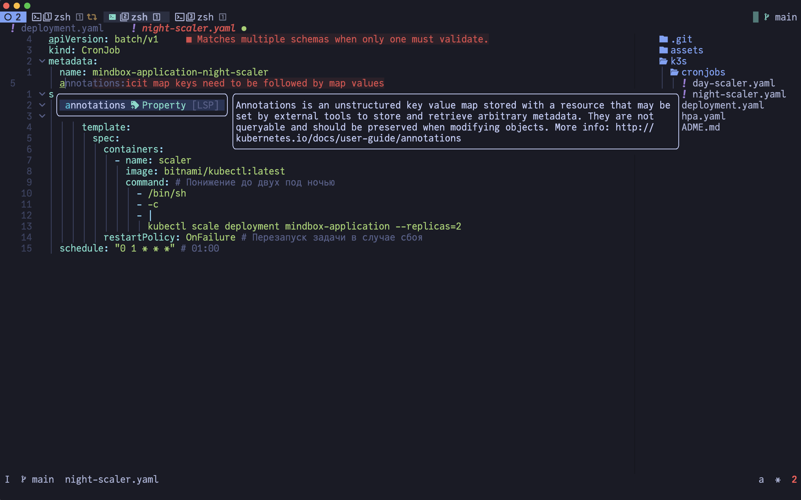

Yaml schemas picker support:

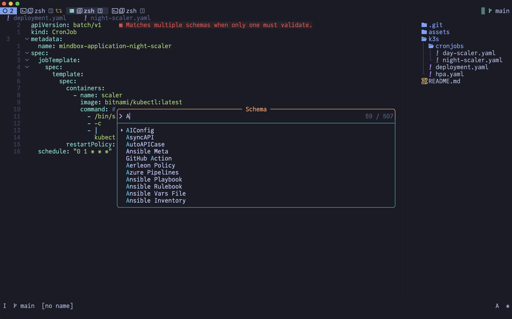

### Json

Json support:

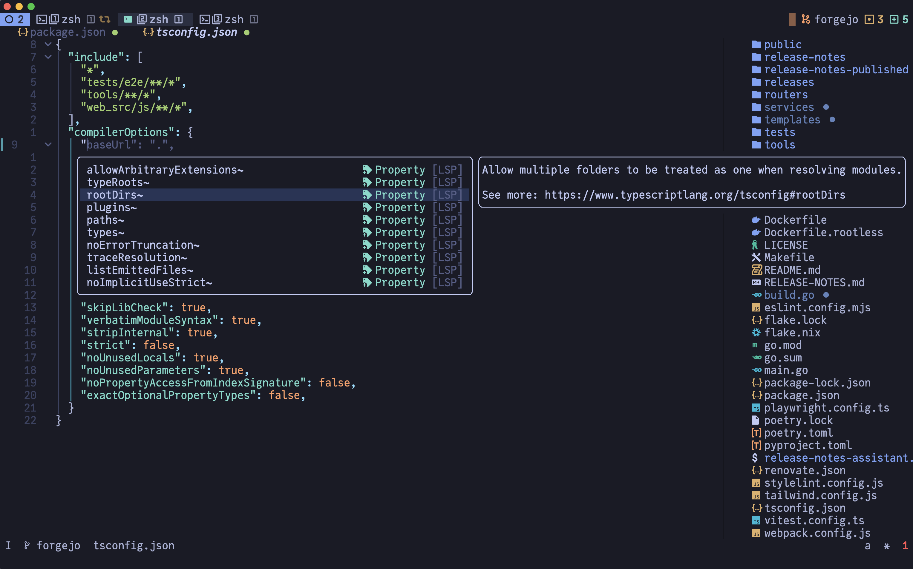

### Xml

Xml support:

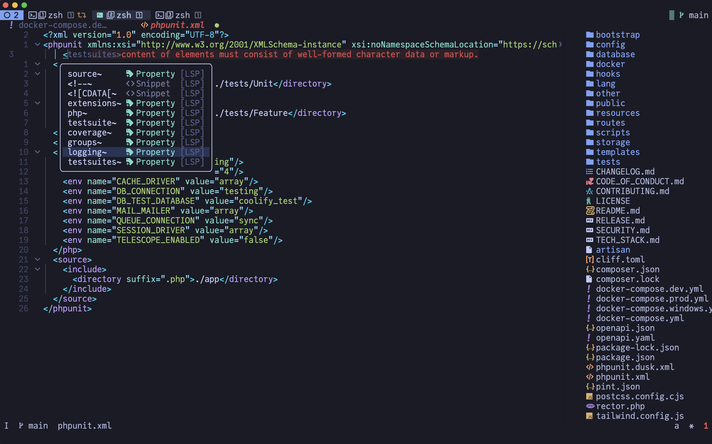

## Protocols

### GraphQL

GraphQL support:

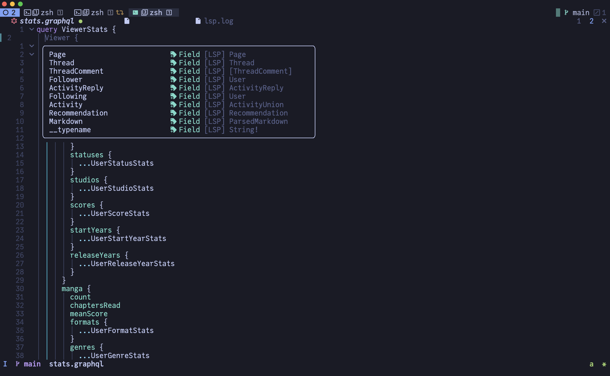

### ProtoBuf

ProtoBuf support:

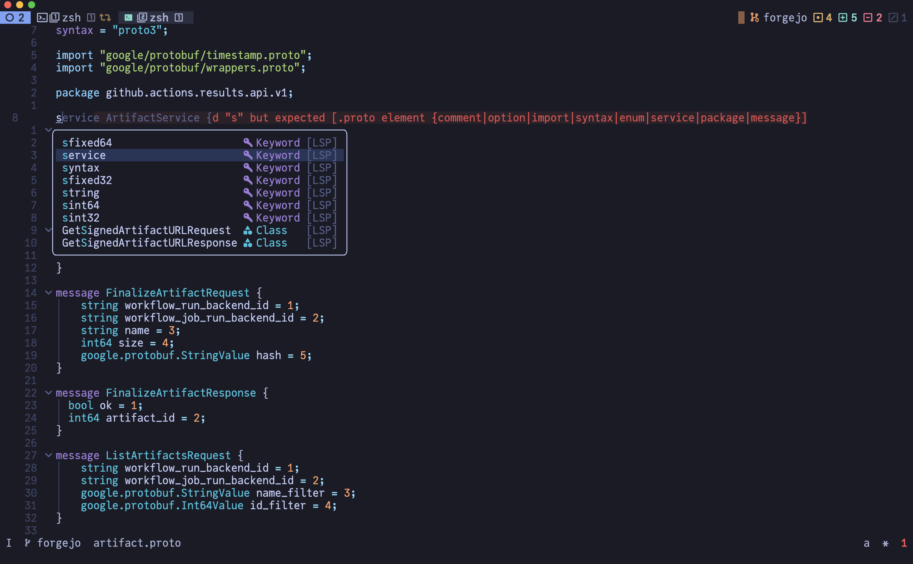

You should install this lsp manually:

```bash
go install github.com/lasorda/protobuf-language-server@latest
```

## DevOps tools

### Docker

Docker support:

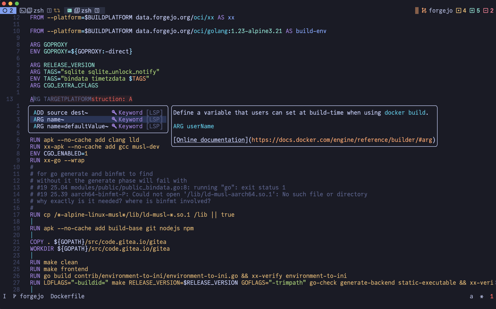

## Build tools

### Bazel

This build system often used when company need a monorepo.

For more information see this links:

- [Bazel Central Registry](https://registry.bazel.build/)
- [Gazelle Module](https://registry.bazel.build/modules/gazelle)
- [Rules Go](https://registry.bazel.build/modules/rules_go)

Bazel support:

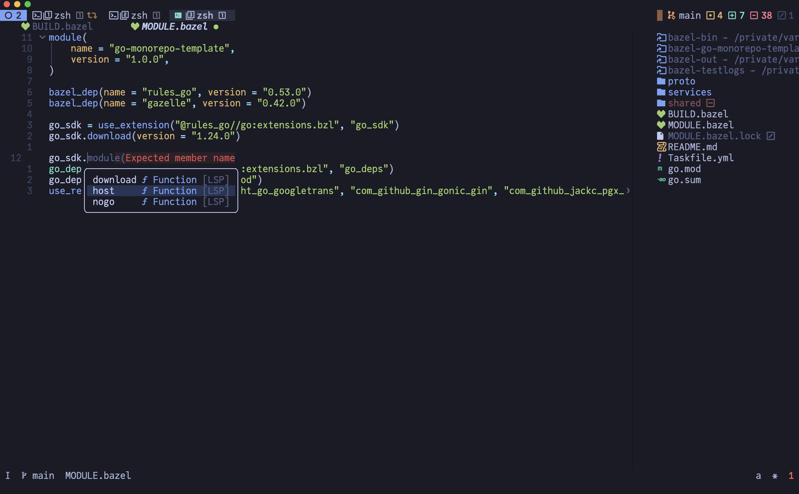
