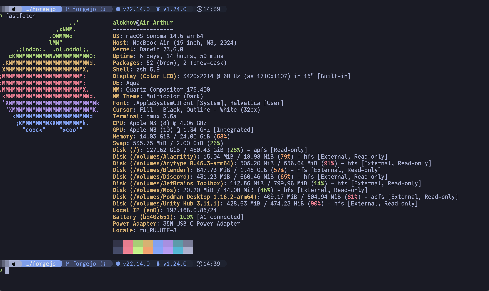
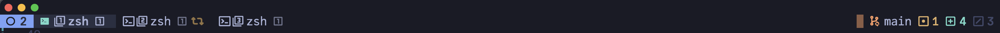

# Terminal configuration

## Alacritty

I prefer [Alacritty](https://github.com/alacritty/alacritty) for its simplicity and good performance.

```toml
# Remove titlebar
[window]
decorations = "Transparent"
padding = { x = 0, y = 25 }

# Configure font
[font]
normal = { family = "JuliaMono Nerd Font", style = "Regular" } # Choose your favorite nerd font
size = 18

# Tokyo Night theme
[colors.primary]
background = '#1a1b26'
foreground = '#a9b1d6'
[colors.normal]
black   = '#32344a'
red     = '#f7768e'
green   = '#9ece6a'
yellow  = '#e0af68'
blue    = '#7aa2f7'
magenta = '#ad8ee6'
cyan    = '#449dab'
white   = '#787c99'
[colors.bright]
black   = '#444b6a'
red     = '#ff7a93'
green   = '#b9f27c'
yellow  = '#ff9e64'
blue    = '#7da6ff'
magenta = '#bb9af7'
cyan    = '#0db9d7'
white   = '#acb0d0'
```

## Zsh

I use Zsh because this is default shell on MacOS. Also I use [starship](https://starship.rs/).



## Tmux

And finally I use [Tmux](https://github.com/tmux/tmux) because it's the best terminal multiplexer.



Tmux also integrated with Neovim via [vim-tmux-navigator](https://github.com/christoomey/vim-tmux-navigator).
